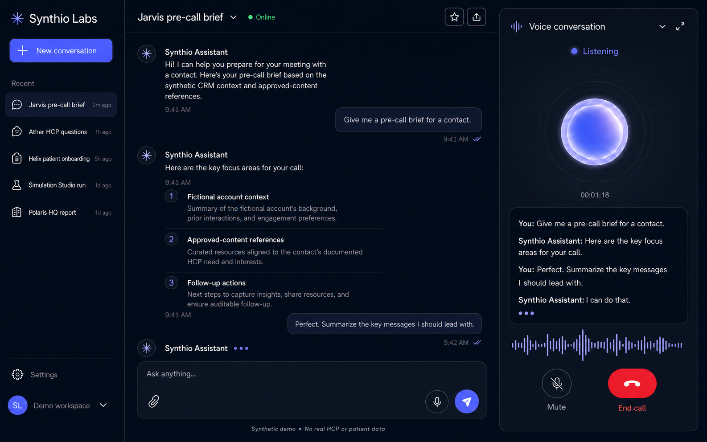

# Synthio Labs AI Assistant

A responsive React + TypeScript assignment prototype for fast, multimodal
life-sciences conversations. It combines streaming text chat, browser voice
interaction, persistent sessions, domain-aware demo scenarios, and resilient
error handling in one polished workspace.

[**Open the Vercel demo**](https://synthio-labs-assistant.vercel.app) ·
[GitHub Pages mirror](https://damrianeelesh.github.io/Synthio-Assignment/) ·
[CI pipeline](https://github.com/DamriaNeelesh/Synthio-Assignment/actions/workflows/deploy-pages.yml)



> This is an independent interview assignment inspired by workflows described
> on the public [Synthio Labs website](https://synthiolabs.com/). It is not an
> official Synthio Labs product or production medical system. Every seeded
> person, organization, conversation, and metric is synthetic. The prototype
> contains no PHI or real HCP data, provides no medical advice, and does not
> connect to real CRM, clinical, safety, or patient-support systems.

## Why this demo is domain-aware

The seeded conversations and mock responses make the assignment immediately
relevant to Synthio Labs' public product areas:

- [Jarvis](https://synthiolabs.com/jarvis): field-team pre-call preparation and
  structured post-call note capture.
- [Ather](https://synthiolabs.com/ather): HCP engagement grounded in approved
  content, with safe escalation for unsupported or off-label questions.
- [Helix](https://synthiolabs.com/helix): patient-support workflow examples for
  onboarding, access, and adherence, using synthetic non-clinical data.
- [Simulation Studio](https://synthiolabs.com/simulation-studio): synthetic HCP
  and patient personas for message and concept testing.
- [Polaris HQ](https://synthiolabs.com/polaris-hq): natural-language questions
  over fictional commercial data, with traceable assumptions.

These are reviewer-friendly scenarios, not claims that this prototype
implements the production capabilities, data sources, compliance controls, or
integrations of the referenced products.

## Run locally

**Prerequisite:** Node.js `^20.19.0`, `^22.12.0`, or `>=24.0.0`.

```bash
npm ci
npm run dev
```

Open [http://localhost:5173](http://localhost:5173). The default mock mode needs
no environment file, API key, backend, or external service.

To exercise the production output locally:

```bash
npm run build
npm run preview
```

Then open [http://localhost:4173](http://localhost:4173).

## Assignment coverage

| Requirement | Implementation |
| --- | --- |
| React + TypeScript | React 19, strict TypeScript, Vite, and reusable feature boundaries |
| Message history | Versioned conversations persist locally and recover safely after refresh |
| User and assistant messages | Distinct roles with streaming, complete, cancelled, and failed states |
| Enter and Send | Keyboard submission plus an explicit, labelled send control |
| Loading and errors | Incremental output, cancellation, inline errors, retry metadata, and an error boundary |
| Voice start/end | Start, mute, resume, and end controls backed by a call state machine |
| Voice status | Connecting, Connected, Listening, Speaking, and Disconnected |
| Live transcript | Interim and final Web Speech results when the browser supports recognition |
| Conversation sessions | Create, switch, rename, delete, and restore previous chats |
| Context attachments | Read small text-based files and include their content in a message |
| API integration | Swappable mock and remote adapters behind one typed streaming contract |
| Responsive UI | Desktop workspace, tablet overlay, mobile drawer, and full-screen call dialog |

## Five-minute evaluator flow

1. Open either live URL, or run `npm ci && npm run dev`.
2. Explore a seeded Jarvis, Ather, Helix, Simulation Studio, or Polaris HQ
   conversation.
3. Create a chat, submit with `Enter`, then use the Send button and observe the
   streamed assistant response.
4. Switch or rename a chat, refresh, and verify that the session is restored.
5. Send `/error` to inspect the deterministic failed-message and retry state.
6. Start a voice call. Grant microphone access for live recognition, or inspect
   the clearly labelled demo fallback.
7. Resize to a narrow viewport and test the session drawer, composer, and voice
   dialog using keyboard and touch controls.
8. Run `npm run check`.

## Chat, persistence, and attachments

The local adapter streams deterministic, domain-aware responses in short chunks
after a small delay, keeping the default experience fast and repeatable.
Including `/error` anywhere in a message deliberately exercises the retryable
error path; retrying that same message deliberately fails again.

Conversation data is stored under `synthio.assignment.conversations` in browser
`localStorage`. The payload is versioned and runtime-validated. Missing,
malformed, or unavailable storage falls back to safe seeded conversations.
Interrupted assistant streams are recovered into an explicit retryable state
instead of appearing complete after a refresh.

The attachment control accepts small `.txt`, `.md`, `.csv`, and `.json` files,
reads their text in the browser, and adds it as visible prompt context. It does
not upload files to a separate service. Do not use real patient, HCP, or
confidential company data in this prototype.

## Voice behavior

Synthio Assistant uses browser-provided speech capabilities:

- `SpeechRecognition` or `webkitSpeechRecognition` supplies interim and final
  transcript text.
- `speechSynthesis` and `SpeechSynthesisUtterance` play assistant responses when
  available.
- Live microphone recognition requires HTTPS or `localhost`, browser support,
  and user permission.
- If recognition is unavailable, the page is insecure, or permission fails,
  the call remains usable in a clearly identified demo mode. Demo mode preserves
  the status experience and never fabricates transcript content.
- Speech playback support is detected separately, so text chat remains usable
  if synthesis is unavailable or interrupted.

For the strongest live-voice test, use a current Chromium-based browser over
HTTPS or `localhost` and allow microphone access when prompted. Recognition
availability and processing depend on the browser and operating system.

## Optional remote chat API

Copy `.env.example` to `.env.local`, configure a compatible browser-accessible
endpoint, and restart Vite:

```dotenv
VITE_CHAT_API_URL=https://your-service.example/chat
```

The value is an endpoint URL, never a provider secret. The browser sends:

```http
POST /chat
Accept: text/event-stream, application/json, text/plain
Content-Type: application/json
```

```json
{
  "conversationId": "conversation-id",
  "message": "Prepare a compliant pre-call brief.",
  "messages": [
    {
      "role": "user",
      "content": "Prepare a compliant pre-call brief."
    }
  ],
  "stream": true
}
```

`messages` contains completed conversation history followed by the current
message. Supported response shapes are:

- `application/json`: a string or an object containing `content`, `reply`,
  `delta`, `message.content`, or a compatible first `choices` entry.
- `text/event-stream` or `application/x-ndjson`: one payload per line; optional
  `data:` prefixes and `[DONE]` markers are supported.
- Any other content type: streamed plain-text chunks.

The endpoint must allow the deployed app origin. Non-2xx responses and invalid
payloads become typed, user-facing errors; `408`, `429`, and `5xx` responses are
marked retryable.

## Architecture

The app uses feature boundaries rather than one page-level state object:

- `src/features/conversations` owns session state, pure reducer transitions,
  seeded synthetic data, persistence, and navigation.
- `src/features/chat` owns the chat UI and typed mock/remote adapter boundary.
- `src/features/voice` owns browser capability detection and the call state
  machine.
- `src/components` contains reusable app-level controls.
- `src/types` contains shared domain models.

Network requests, local storage, speech recognition, and speech synthesis stay
behind dedicated boundaries. This keeps UI components focused and makes the
critical state transitions independently testable. See
[the architecture notes](docs/architecture.md) for the complete flow.

## Quality and accessibility

```bash
npm run check
```

The release gate runs linting, strict type validation, the automated Vitest
suite, and a production build.

| Command | Purpose |
| --- | --- |
| `npm run lint` | ESLint checks |
| `npm run typecheck` | TypeScript project validation |
| `npm test` | One-shot Vitest run in JSDOM |
| `npm run test:watch` | Interactive Vitest watch mode |
| `npm run build` | Type-check and generate `dist/` |
| `npm run preview` | Serve the production build locally |

The automated suite covers reviewer flows, conversation reducers and storage,
interrupted-stream recovery, remote JSON/SSE/NDJSON parsing, mock
streaming/error/abort behavior, rich-message ordering, Web Speech capability
mapping, and voice lifecycle cleanup.

Semantic landmarks, labelled controls, focus management, live status
announcements, touch-friendly targets, reduced-motion support, long-content
wrapping, and responsive dialogs are built into the experience.

## Deployment

- **Vercel:** the primary deployment is
  [synthio-labs-assistant.vercel.app](https://synthio-labs-assistant.vercel.app).
  `vercel.json` runs `npm run build` and publishes `dist`.
- **GitHub Pages:** each push to `main` runs `npm run check` in a clean Linux
  runner before deploying `dist` through
  `.github/workflows/deploy-pages.yml`.
- **Netlify-ready:** `netlify.toml` defines the build, publish directory, and
  baseline security headers.

For any host, set `VITE_CHAT_API_URL` at build time only when using a compatible
remote endpoint. The zero-setup mock remains the default.
