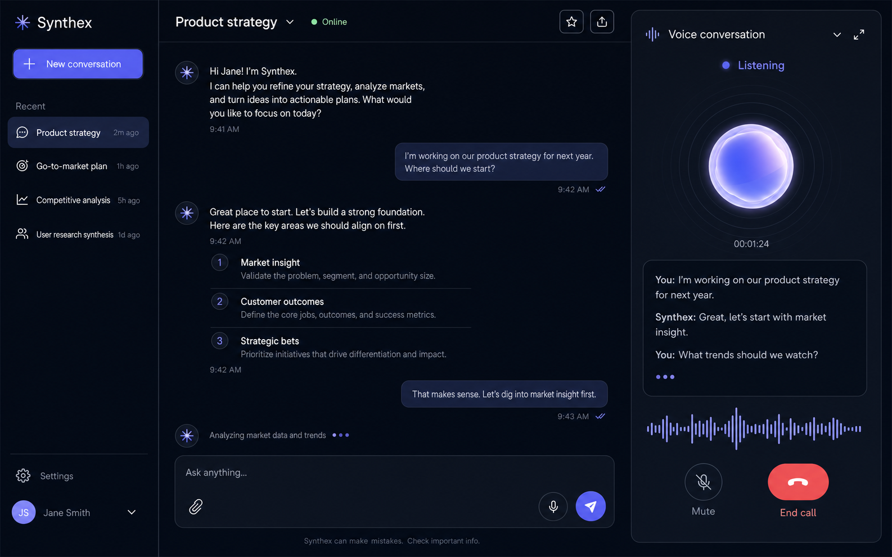

# Synthex

Synthex is a responsive AI assistant experience built for the Synthio Labs
frontend assignment. It combines streaming text chat, browser voice interaction,
and persistent conversation management in a polished React 19 + TypeScript
interface.

The default experience is intentionally zero-setup: it uses a fast local mock
adapter, so reviewers can test the complete interaction flow without API keys or
a backend.



> This is the desktop design concept used to guide the implementation. It can be
> replaced with a current product screenshot before the final submission.

## Run locally

**Prerequisite:** Node.js `^20.19.0`, `^22.12.0`, or `>=24.0.0`.

```bash
npm ci && npm run dev
```

Open [http://localhost:5173](http://localhost:5173). No `.env` file, API key, or
external service is required.

To exercise the production build locally:

```bash
npm run build
npm run preview
```

Then open [http://localhost:4173](http://localhost:4173).

## Assignment coverage

| Requirement | Implementation |
| --- | --- |
| React + TypeScript | React 19, strict TypeScript, and Vite |
| Message history | Versioned conversations persist in `localStorage` and restore after refresh |
| User/assistant messages | Distinct roles with streaming, complete, and failed message states |
| Enter and Send | Keyboard submission and an explicit send control |
| Loading and errors | Incremental assistant output, request cancellation, inline failure feedback, and retry metadata |
| Voice start/end | A browser voice call controller with explicit start, mute, and end actions |
| Voice status | `Connecting`, `Connected`, `Listening`, `Speaking`, and `Disconnected` states |
| Live transcript | Interim and final Web Speech recognition results when supported |
| Conversation sessions | Create, switch, rename, and delete conversations |
| API integration | Swappable mock and remote chat adapters behind one typed interface |
| Responsive UI | Desktop workspace, tablet overlay behavior, and mobile drawer/full-screen call patterns |

## Reviewer-friendly demo behavior

The built-in mock adapter streams deterministic responses in small chunks with
a short simulated delay. It recognizes common prompts about planning,
summarizing, interview preparation, and greetings.

Send a message containing `/error` to force the mock adapter's error path. This
is a deterministic way to inspect the failed-message UI and retry affordance
without disconnecting the network. Retrying the same `/error` request will
deliberately fail again.

Conversation state is stored under `synthex.conversations` in browser
`localStorage`. Stored data is versioned and validated before use; missing,
unavailable, or malformed storage falls back to the seeded demo conversations.

## Voice behavior

Synthex uses browser-provided speech capabilities and requires no separately
configured voice API or key:

- `SpeechRecognition` or `webkitSpeechRecognition` supplies interim and final
  transcript text.
- `speechSynthesis` and `SpeechSynthesisUtterance` play assistant speech when
  available.
- Microphone recognition requires HTTPS or `localhost`, browser support, and
  user permission.
- If recognition is unsupported, the page is insecure, permission is denied, or
  no microphone is available, the call continues in a clearly identified demo
  mode. Demo mode preserves the call-state experience and never invents
  transcript content.
- Text remains available if speech playback is unsupported or interrupted.

For the most complete live-voice test, use a current Chromium-based browser on
HTTPS or `localhost` and grant microphone permission when prompted. Browser and
operating-system speech availability and processing can vary.

## Optional remote chat API

Copy the example environment file and set a compatible endpoint:

```bash
cp .env.example .env.local
```

```dotenv
VITE_CHAT_API_URL=https://your-service.example/chat
```

Restart the development server after changing the value. Vite exposes
`VITE_*` values to browser code, so this must be an endpoint URL—not a provider
secret or API key. The browser sends:

```http
POST /chat
Accept: text/event-stream, application/json, text/plain
Content-Type: application/json
```

```json
{
  "conversationId": "conversation-id",
  "message": "The current user message",
  "messages": [
    { "role": "user", "content": "Earlier message" },
    { "role": "assistant", "content": "Earlier response" },
    { "role": "user", "content": "The current user message" }
  ],
  "stream": true
}
```

`messages` contains the completed existing conversation history followed by the
current user message. The endpoint may respond in any of these forms:

- `application/json`: a string, or an object containing `content`, `reply`,
  `delta`, `message.content`, or a compatible first `choices` entry.
- `text/event-stream` or `application/x-ndjson`: one payload per line. A line may
  start with `data:` and `[DONE]` is ignored. JSON line payloads use the same
  content fields as above.
- Any other content type: streamed text chunks.

The endpoint must be reachable from the browser and allow the deployed
application's origin. Non-2xx responses and invalid response shapes are mapped
to typed, user-facing errors; `408`, `429`, and `5xx` responses are marked
retryable.

## Quality checks

```bash
npm run check
```

This runs linting, TypeScript validation, the Vitest suite, and a production
build. Individual commands are also available:

| Command | Purpose |
| --- | --- |
| `npm run lint` | ESLint checks |
| `npm run typecheck` | TypeScript project validation |
| `npm test` | One-shot Vitest run in JSDOM |
| `npm run test:watch` | Interactive Vitest watch mode |
| `npm run build` | Type-check and generate `dist/` |
| `npm run preview` | Serve the production build locally |

Tests cover the conversation reducer and persistence boundary, mock streaming
and abort/error behavior, browser voice capability mapping, and the voice-call
state controller.

## Architecture

The project uses feature boundaries instead of a single page-level state blob:

- `src/features/chat` owns chat UI and the typed mock/remote adapter boundary.
- `src/features/conversations` owns session state, reducer transitions,
  persistence, and navigation.
- `src/features/voice` owns browser capability detection and the call state
  machine.
- `src/components` contains reusable application-level controls.
- `src/types` contains shared domain models.

Conversation transitions are pure reducer actions. Browser storage, network
requests, speech recognition, and synthesis stay behind dedicated boundaries,
which keeps components easier to reason about and unit-test. See
[docs/architecture.md](docs/architecture.md) for the data flow and design
decisions.

## Accessibility and performance

- Semantic navigation, headings, forms, and buttons support keyboard and
  assistive-technology use.
- Visible focus treatments, control labels, status announcements, and
  `aria-current` communicate interactive state without relying only on color.
- Mobile controls use touch-friendly targets, and responsive layouts avoid
  horizontal page scrolling.
- Motion is reserved for useful feedback and respects reduced-motion
  preferences.
- The default adapter begins responding after a short local delay and streams
  small chunks, keeping the demo responsive without a network round trip.
- Requests and browser speech work are cancellable, and voice timers/listeners
  are cleaned up when a call ends or the feature unmounts.

## Deployment

The repository includes deployment configuration for both platforms:

### Vercel

Import the repository into Vercel. The included `vercel.json` runs
`npm run build` and publishes `dist`.

If using a remote API, add `VITE_CHAT_API_URL` to the project environment before
deploying.

### Netlify

Import the repository into Netlify. The included `netlify.toml` runs
`npm run build`, publishes `dist`, and adds basic security headers.

If using a remote API, add `VITE_CHAT_API_URL` to the site environment before
deploying.

## Evaluator checklist

A focused review takes only a few minutes:

1. Run `npm ci && npm run dev`; confirm the seeded conversation opens.
2. Create a conversation, send once with `Enter`, and once with the Send button;
   observe streamed assistant output.
3. Switch between conversations, rename one, refresh, and confirm state
   persistence.
4. Send `/error` and inspect the deterministic error/retry state.
5. Start a voice call. With permission and browser support, speak and observe the
   interim/final transcript and status transitions; otherwise confirm the
   explicit demo fallback.
6. End the call and verify the interface returns to `Disconnected`.
7. Resize from desktop to a narrow mobile viewport and test the conversation
   drawer, chat composer, and voice surface with the keyboard.
8. Run `npm run check`.
