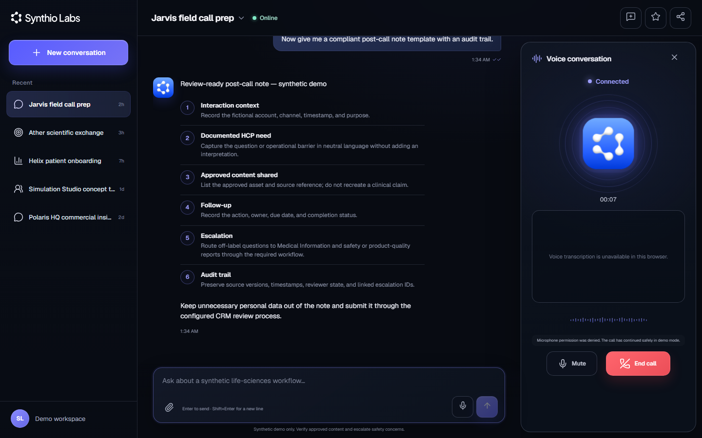
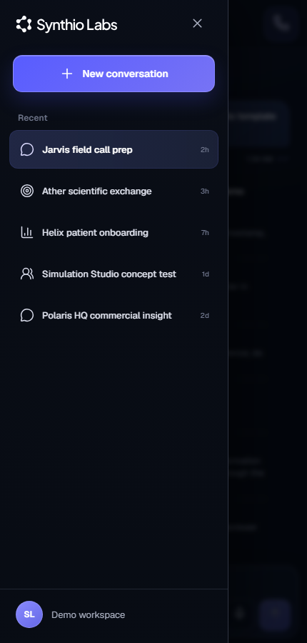
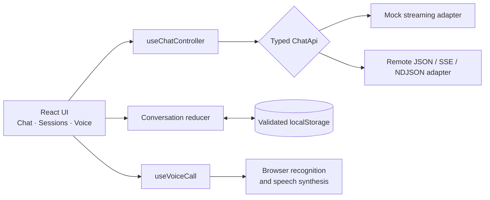

<p align="center">
  <picture>
    <source
      media="(prefers-color-scheme: dark)"
      srcset="public/synthio-logo-white.svg"
    />
    
  </picture>
</p>

<h1 align="center">Multimodal AI Assistant</h1>

<p align="center">
  A fast, responsive React + TypeScript interview assignment for text chat,
  voice interaction, and persistent conversation sessions.
</p>

<p align="center">
  <a href="https://synthio-labs-assistant.vercel.app"><strong>Open the live demo →</strong></a>
  ·
  <a href="https://damrianeelesh.github.io/Synthio-Assignment/">GitHub Pages mirror</a>
  ·
  <a href="https://github.com/DamriaNeelesh/Synthio-Assignment/actions/workflows/deploy-pages.yml">CI pipeline</a>
</p>

<p align="center">
  <a href="https://github.com/DamriaNeelesh/Synthio-Assignment/actions/workflows/deploy-pages.yml">
    
  </a>
</p>

> **Independent prototype:** This is an interview assignment inspired by
> publicly described [Synthio Labs](https://synthiolabs.com/) workflow themes.
> It is not an official Synthio Labs product or a production medical system.
> Every person, organization, conversation, and metric in the demo is
> synthetic.



<p align="center">
  <sub>Actual application UI — persistent sessions, structured chat, and the
  voice experience running together at 1440×900.</sub>
</p>

## 60-second overview

| Reviewer question | Answer |
| --- | --- |
| What does it demonstrate? | A complete text-and-voice assistant with session management, streaming responses, browser speech integration, responsive layouts, and resilient errors. |
| Can I test it immediately? | Yes. Start a fresh conversation and choose any of six synthetic workflow cards; one click sends the complete prompt. The default mock mode needs no account, API key, backend, or environment file. |
| Why is it relevant to Synthio Labs? | Six reviewer-ready starter workflows cover the public themes of Jarvis, Ather, Helix, Simulation Studio, and Polaris HQ plus a cross-workflow safety handoff, without claiming access to production systems. |
| Is the architecture production-minded? | Strict TypeScript, feature boundaries, reducer-driven state, runtime-validated persistence, typed API adapters, accessible UI semantics, and recoverable failure states. |
| How is it verified? | 79 automated tests, lint, strict type checking, a production build, zero dependency vulnerabilities, and Playwright checks across desktop, mobile, breakpoint, and short-landscape layouts. |
| Where is it deployed? | Vercel is the primary demo; GitHub Pages is an independently built mirror. The repository is also Netlify-ready. |

## Five-minute evaluator flow

1. Open the [Vercel demo](https://synthio-labs-assistant.vercel.app).
2. Create a new conversation and choose one of the six starter cards. The
   Jarvis, Ather, Helix, Simulation Studio, Polaris HQ, and safety prompts send
   immediately so you can inspect streaming without composing a test request.
3. Return to a fresh conversation and select **Simulate a retryable error**.
   The shortcut intentionally sends `/error`; inspect the inline failure and
   Retry control, then continue testing with any workflow card.
4. Switch between the seeded product-theme conversations, then type and submit
   your own message with `Enter`.
5. Start a voice conversation. Allow microphone access when available, or
   inspect the clearly labelled safe demo fallback.
6. Rename or switch a conversation, refresh the page, and confirm that the
   active session and history are restored.
7. Resize to a narrow viewport and test the starter gallery, session drawer,
   composer, and full-screen voice interface.
8. Clone the repository and run `npm ci && npm run check` for the complete
   local release gate.

## What stands out

- **Fast by default:** immediate local updates, incremental mock streaming, a
  compact production bundle, and no backend round-trip in the zero-setup
  evaluator path.
- **Reviewer-first discovery:** every fresh chat presents six concise,
  Synthio-specific synthetic workflow cards that send in one click, plus a
  clearly labelled shortcut for the intentional retry-error state.
- **One coherent multimodal experience:** chat history, session state, live
  transcript, speech playback, mute/resume, and end-call behavior share the
  same responsive workspace.
- **Honest capability handling:** unsupported speech recognition or denied
  microphone access becomes an explicit demo mode—never a fabricated
  transcript.
- **Domain-aware without overclaiming:** reviewer-ready life-sciences examples
  use synthetic data, approved-content reminders, source traceability, and safe
  escalation language.
- **Failure-aware:** malformed storage, interrupted streams, remote API
  failures, denied permissions, and unsupported browser features all have
  intentional recovery paths.
- **Accessible and responsive:** semantic landmarks, labelled icon controls,
  keyboard workflows with deterministic focus handoff, modal focus
  containment/restoration, live regions, touch-friendly targets,
  reduced-motion support, and layouts down to `320px`.

<details>
<summary><strong>See the responsive 430px session drawer</strong></summary>

<p align="center">
  
</p>

</details>

## Assignment coverage

| Requirement | Implementation |
| --- | --- |
| React + TypeScript | React 19, strict TypeScript, Vite, and reusable feature boundaries |
| Message history | Versioned conversations persist locally and recover safely after refresh |
| User and assistant bubbles | Distinct roles with streaming, complete, and failed/retryable states; interrupted requests remain retryable |
| Enter and Send | Keyboard submission plus an explicit, labelled Send button |
| Loading and errors | Incremental output, typing feedback, inline errors, retry metadata, and a top-level error boundary |
| Start / End call | Start, mute, resume, and end controls backed by a typed call state machine |
| Voice status | Connecting, Connected, Listening, Speaking, and Disconnected |
| Live transcript | Interim and final Web Speech results when recognition is available |
| Conversation sessions | Create, switch, rename, delete, favorite, and restore previous chats |
| Fresh-chat guidance | Six accessible, one-click synthetic workflow cards plus an intentional retry-error shortcut |
| Chat API | Swappable mock and remote adapters behind one typed streaming contract |
| Voice API | Browser speech recognition and synthesis isolated behind a dedicated adapter layer |
| Responsive design | Desktop workspace, tablet overlay, mobile drawer, and full-screen call dialog |

### Useful extras beyond the brief

- Local `.txt`, `.md`, `.csv`, and `.json` context attachments up to 16 KB.
- Six one-click workflow starters shown whenever a conversation has no
  messages.
- Clearly labelled reviewer shortcut that sends the deterministic `/error`
  command for fast retry-state testing.
- Copy message, share conversation, favorites, and editable session names.
- JSON, plain text, SSE, and NDJSON remote response parsing.
- Versioned `localStorage` schema with runtime validation and recovery.
- Web app manifest, favicons, GitHub Pages CI, Vercel, and Netlify config.

## Synthio Labs workflow themes

These scenarios are inspired by publicly described product themes. They
demonstrate interaction design and safe workflow boundaries—not the production
capabilities, data, compliance controls, or integrations of those products.
Every fresh chat exposes all six as one-click prompts, ordered from field and
scientific workflows through patient support, research, analytics, and a
cross-workflow safety drill.

| Public product theme | Synthetic demo scenario | UX demonstrated |
| --- | --- | --- |
| [Jarvis](https://synthiolabs.com/jarvis) | Pre-call preparation and a review-ready post-call note from a fictional CRM record | Structured context, approved-content prompts, follow-up ownership, and an audit trail |
| [Ather](https://synthiolabs.com/ather) | A fictional HCP scientific question | Mock grounding, source traceability, response boundaries, and Medical Information escalation |
| [Helix](https://synthiolabs.com/helix) | Fictional patient-support onboarding with no PHI | Access, onboarding, adherence-support steps, and non-clinical escalation |
| [Simulation Studio](https://synthiolabs.com/simulation-studio) | Synthetic HCP and patient persona testing | Message feedback, concept comparison, and clearly labelled synthetic evidence |
| [Polaris HQ](https://synthiolabs.com/polaris-hq) | Natural-language questions over fictional commercial metrics | Assumption-aware summaries and traceable next questions |
| Cross-workflow safety drill | A fictional caller reports a possible adverse event | Neutral acknowledgement, minimum-data handling, immediate human escalation, and no diagnosis or medical advice |

## Architecture

The project separates UI, state, browser capabilities, and data access so each
boundary can be replaced or tested independently.



```text
src/
├── components/                 Reusable app shell and brand components
├── features/
│   ├── chat/                   Composer, messages, controller, mock/remote APIs
│   ├── conversations/          Reducer, persistence, seeds, provider, sidebar
│   └── voice/                  Call state machine and browser speech boundary
├── types/                      Shared domain models
├── App.tsx                     Responsive feature composition
└── styles.css                  Tokens, layouts, states, and motion
```

Network requests, storage, speech recognition, and speech synthesis stay behind
dedicated boundaries. See [the architecture notes](docs/architecture.md) for
state transitions, recovery behavior, and extension points.

## Verified quality

Latest release verification:

| Check | Result |
| --- | --- |
| `npm run lint` | Passed |
| `npm run typecheck` | Passed with strict TypeScript |
| `npm test` | **79 / 79 tests passed** across 12 test files |
| `npm run build` | Passed; production JS is 270.95 KB / 83.75 KB gzip and CSS is 36.74 KB / 8.79 KB gzip |
| `npm audit --audit-level=high` | **0 vulnerabilities** |
| Rendered browser QA | Zero console errors; chat and voice exercised at desktop, mobile, `320px`, breakpoint, and short-landscape viewports |
| Responsive boundary matrix | No horizontal overflow or header collisions at `375`, `420`, `768`, `860`, `1179`, or `1180` pixels |

The automated suite covers:

- critical reviewer flows and Enter-to-send behavior;
- all six starter prompts, their exact payloads, disabled behavior, fresh-chat
  auto-scroll, and deterministic product-response routing;
- conversation reducer transitions and persistence validation;
- interrupted-stream recovery and retry metadata;
- mock streaming, deterministic failures, and abort handling;
- remote JSON, SSE, NDJSON, and plain-text parsing;
- rich-message ordering and structured response blocks;
- Web Speech capability/error mapping and voice lifecycle cleanup;
- official brand asset paths, dimensions, and accessible semantics.

## Run locally

**Prerequisite:** Node.js `^20.19.0`, `^22.12.0`, or `>=24.0.0`.

```bash
git clone https://github.com/DamriaNeelesh/Synthio-Assignment.git
cd Synthio-Assignment
npm ci
npm run dev
```

Open [http://localhost:5173](http://localhost:5173). No environment variables
are required for the default mock experience.

To exercise the exact production output locally:

```bash
npm run build
npm run preview
```

Then open [http://localhost:4173](http://localhost:4173).

### Commands

| Command | Purpose |
| --- | --- |
| `npm run dev` | Start the Vite development server |
| `npm run lint` | Run ESLint |
| `npm run typecheck` | Validate both TypeScript projects |
| `npm test` | Run the Vitest suite once |
| `npm run test:watch` | Run Vitest in watch mode |
| `npm run build` | Type-check and generate `dist/` |
| `npm run preview` | Serve the production build locally |
| `npm run check` | Run lint, types, tests, and production build in sequence |

## Implementation details

<details>
<summary><strong>Chat, persistence, errors, and attachments</strong></summary>

The local adapter streams deterministic, domain-aware responses in short
chunks after a small delay. This keeps the default experience fast, repeatable,
and independent of external uptime.

Conversation data is stored under
`synthio.assignment.conversations` in browser `localStorage`. The payload is
versioned and runtime-validated. Missing, malformed, or unavailable storage
falls back to safe seeded conversations. Interrupted assistant streams recover
into an explicit retryable state instead of appearing complete after refresh.
Persistence is limited to the current browser profile and device.

Including `/error` anywhere in a message deliberately exercises the retryable
error path. Retrying the same message deliberately fails again so reviewers can
inspect a stable error state.

The attachment control accepts `.txt`, `.md`, `.csv`, and `.json` files up to
16 KB. It reads content locally and adds it as visible prompt context; it does
not upload files to a separate service. Never use real patient, HCP,
confidential, or sensitive company data in this prototype.

</details>

<details>
<summary><strong>Voice behavior and browser support</strong></summary>

- `SpeechRecognition` or `webkitSpeechRecognition` supplies interim and final
  transcript text.
- `speechSynthesis` and `SpeechSynthesisUtterance` play assistant responses
  when available.
- Live recognition requires HTTPS or `localhost`, browser support, and
  microphone permission.
- If recognition is unavailable, the context is insecure, or permission is
  denied, the call remains usable in a clearly identified demo mode.
- Demo mode preserves the status and control experience but never fabricates
  transcript content.
- Speech playback support is detected separately, so text chat remains usable
  if synthesis is unavailable or interrupted.

For the strongest test, use a current Chromium-based browser over HTTPS or
`localhost` and allow microphone access. Recognition availability, audio
processing, and privacy behavior depend on the browser and its speech provider.
Do not use sensitive data.

</details>

<details>
<summary><strong>Optional remote chat API contract</strong></summary>

Copy `.env.example` to `.env.local`, set a compatible browser-accessible
endpoint, and restart Vite:

```dotenv
VITE_CHAT_API_URL=https://your-service.example/chat
```

The value is an endpoint URL, never a provider secret. Anything prefixed with
`VITE_` is bundled into client code.

The browser sends:

```http
POST /chat
Accept: text/event-stream, application/json, text/plain
Content-Type: application/json
```

```json
{
  "conversationId": "conversation-id",
  "message": "Prepare a compliant pre-call brief.",
  "messages": [
    {
      "role": "user",
      "content": "Prepare a compliant pre-call brief."
    }
  ],
  "stream": true
}
```

`messages` contains completed conversation history followed by the current
message. Supported response shapes:

- `application/json`: a string or an object containing `content`, `reply`,
  `delta`, `message.content`, or a compatible first `choices` entry;
- `text/event-stream` or `application/x-ndjson`: one payload per line, with
  optional `data:` prefixes and `[DONE]` markers;
- any other content type: streamed plain-text chunks.

The endpoint must allow the deployed app origin through CORS. Non-2xx responses
and invalid payloads become typed, user-facing errors; `408`, `429`, and `5xx`
responses are marked retryable.

</details>

## Deployment

| Target | Status and behavior |
| --- | --- |
| [Vercel](https://synthio-labs-assistant.vercel.app) | Primary production demo; `vercel.json` runs `npm run build` and publishes `dist/` |
| [GitHub Pages](https://damrianeelesh.github.io/Synthio-Assignment/) | Mirror deployed from `main` only after the complete release gate passes in a clean Linux runner |
| Netlify | `netlify.toml` defines the build, publish directory, and baseline security headers |

For any host, set `VITE_CHAT_API_URL` at build time only when using a compatible
remote endpoint. The zero-setup mock remains the default.

## Prototype boundaries

- No PHI, real HCP data, medical advice, clinical decision support, or real
  safety reports are used.
- No live CRM, clinical, commercial, patient-support, Medical Information, or
  Synthio Labs product integration is claimed.
- Default responses are deterministic mock content designed for evaluation, not
  a hosted foundation model.
- Browser persistence does not synchronize across profiles or devices.
- Web Speech support and processing depend on the browser, operating system,
  network context, and speech provider.
- Remote endpoints are visible to the client, must support CORS, and must never
  rely on a secret embedded in a `VITE_*` variable.

## Brand and design notes

The prototype self-hosts public Synthio Labs SVG/PNG identity assets and the
Geist variable font for accurate, fast, offline-safe visual alignment. Their use
is limited to presenting this independent assignment and does not imply
affiliation or endorsement.

- [Design system](docs/design/design-system.md)
- [Brand and design fidelity ledger](docs/design/fidelity-ledger.md)
