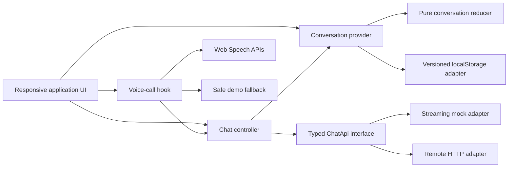
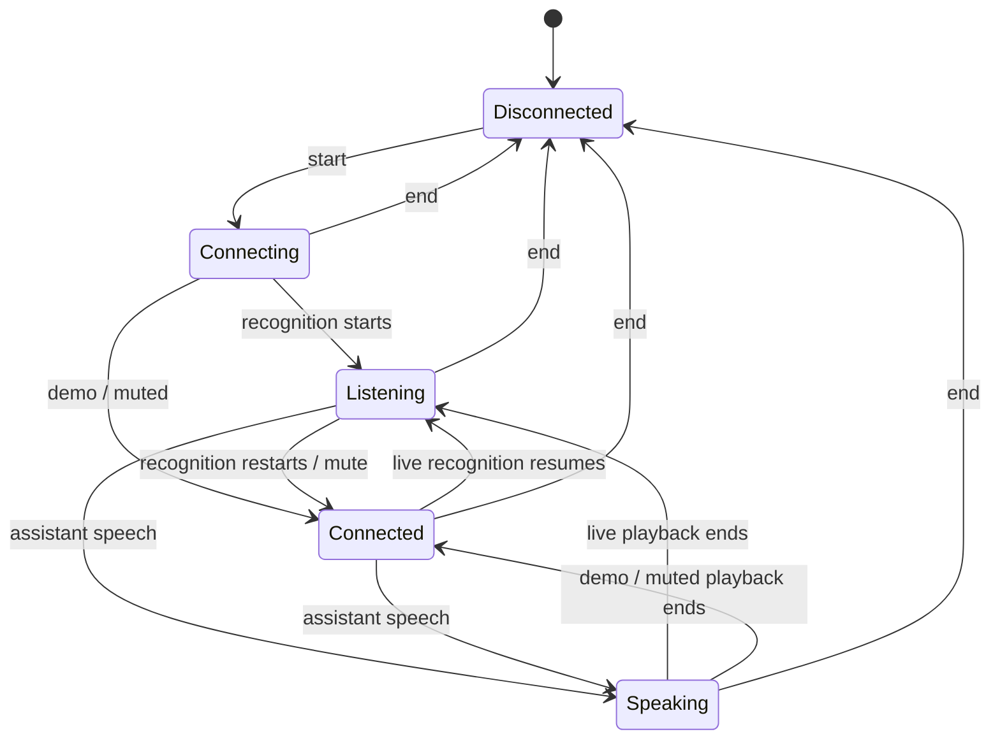

# Synthex architecture

## Design goals

Synthex is organized around three independently testable capabilities:
conversation sessions, streaming chat, and browser voice. The UI composes those
capabilities but does not own their infrastructure details.



## Feature boundaries

### Conversations

`ConversationProvider` exposes a small command-oriented interface for creating,
selecting, renaming, and deleting conversations and for progressing assistant
messages through `streaming`, `complete`, and `error` states.

The underlying reducer stays pure. The provider handles IDs and timestamps, then
persists every committed state through the storage adapter. The persisted
payload has an explicit schema version and is validated at runtime before being
accepted. Invalid or inaccessible storage safely returns seeded state.

The first user message derives a concise title for a new conversation. Updating
a conversation moves it to the front of the recent list.

### Chat

Both chat implementations satisfy the same `ChatApi` interface:

```ts
interface ChatApi {
  streamMessage(request: {
    conversationId: string;
    message: string;
    history?: readonly { role: 'user' | 'assistant'; content: string }[];
    signal?: AbortSignal;
    onChunk: (chunk: { delta: string; index: number }) => void | Promise<void>;
  }): Promise<{
    id: string;
    content: string;
    provider: 'mock' | 'remote';
    finishedAt: string;
  }>;
}
```

The local adapter uses deterministic, abort-aware delays and word chunks. The
remote adapter normalizes JSON, line-delimited event/NDJSON payloads, and raw
text streams into the same chunk callback. UI state is therefore independent of
the response transport.

An `AbortSignal` follows each in-flight request. Expected aborts are kept
separate from service failures, while typed errors retain retryability and HTTP
status details.

### Voice

The voice controller exposes one state model to desktop and mobile surfaces:



Capability detection is explicit. Live mode requires a secure context and
`SpeechRecognition`/`webkitSpeechRecognition`. Synthesis is detected
independently. When recognition is unavailable or permission fails, the
controller changes to demo mode and reports why; it never inserts fabricated
transcript text. Speech synthesis failures keep the text response usable.

Recognition, synthesis, timers, and restart callbacks are stopped or invalidated
when the call ends and during unmount cleanup.

## State and data flow

1. A user submission is appended immediately to the active conversation.
2. An empty assistant message is appended with `streaming` status.
3. Each adapter chunk updates only that message through the reducer.
4. A successful response marks it `complete`; a failure attaches a typed error
   and retry metadata.
5. Every reducer transition is persisted locally.
6. A final voice transcript can enter the same chat submission path; an
   assistant response can enter the voice controller's synthesis path.

This optimistic append plus incremental update model keeps perceived latency
low while preserving a serializable conversation history.

## Responsive composition

The design system defines three layout modes:

- `>=1180px`: conversation rail, open chat canvas, and contextual voice rail.
- `768px–1179px`: conversation rail and chat with voice presented as an overlay.
- `<768px`: drawer navigation, edge-to-edge chat, and a full-screen call
  surface.

The same state and feature components drive each presentation; breakpoints
change composition, not behavior.

## Accessibility decisions

- Landmark elements and labelled navigation describe page structure.
- Conversation selection uses `aria-current`.
- Icon-only controls have programmatic labels.
- Forms retain normal keyboard behavior, including `Enter` submission and
  `Escape` cancellation where appropriate.
- Status and message feedback can be announced without requiring visual
  inspection.
- Focus styles and status colors are designed to remain distinguishable on the
  dark palette.
- Reduced-motion preferences disable nonessential movement.

## Verification strategy

The automated suite concentrates on high-value state boundaries:

- reducer invariants, ordering, titles, streaming, completion, failure, and
  retries;
- storage round trips and fallback from malformed/unavailable data;
- mock streaming, deterministic error behavior, and cancellation;
- Web Speech support/error normalization;
- voice status, transcript, mute, speech, fallback, and teardown behavior.

`npm run check` is the release gate: lint, type-check, test, then production
build.
