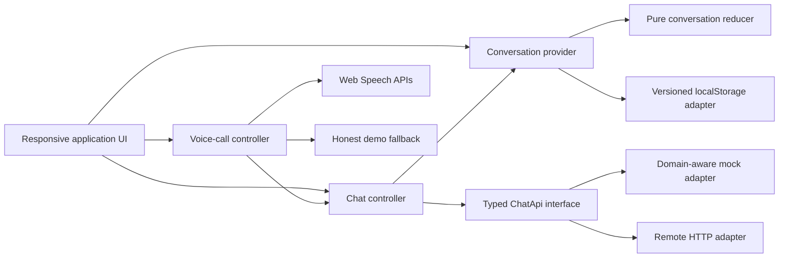
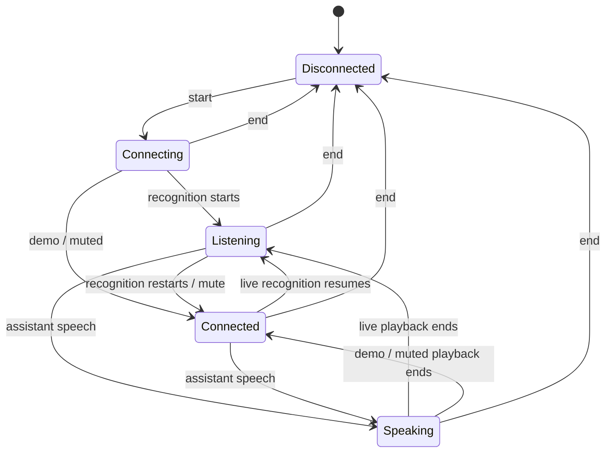

# Synthio Labs AI Assistant architecture

## Design goals

The prototype is organized around three independently testable capabilities:
conversation sessions, streaming chat, and browser voice. The UI composes those
capabilities without owning their infrastructure details.



## Feature boundaries

### Conversations

`ConversationProvider` exposes a command-oriented interface for creating,
selecting, renaming, and deleting conversations and for progressing assistant
messages through `streaming`, `complete`, and `error` states.

The reducer stays pure. The provider handles IDs and timestamps, then persists
committed state through a storage adapter. Its payload has an explicit schema
version and is validated before use; invalid or inaccessible storage safely
returns synthetic seeded state. An interrupted stream is recovered as a
retryable error rather than silently presented as a complete response.

The first user message derives a concise title for a new conversation. Updating
a conversation moves it to the front of the recent list.

### Chat

Both chat implementations satisfy the same transport-agnostic contract:

```ts
interface ChatApi {
  streamMessage(request: {
    conversationId: string;
    message: string;
    history?: readonly { role: 'user' | 'assistant'; content: string }[];
    signal?: AbortSignal;
    onChunk: (chunk: { delta: string; index: number }) => void | Promise<void>;
  }): Promise<{
    id: string;
    content: string;
    provider: 'mock' | 'remote';
    finishedAt: string;
  }>;
}
```

The local adapter uses deterministic, abort-aware delays and domain-aware word
chunks. The remote adapter normalizes JSON, line-delimited event/NDJSON
payloads, and raw text streams into the same callback. UI state therefore does
not depend on response transport.

An `AbortSignal` follows each in-flight request. Expected cancellations remain
separate from service failures, while typed errors retain retryability and HTTP
status information.

Small `.txt`, `.md`, `.csv`, and `.json` attachments are read in the browser and
included as visible message context. This prototype has no separate upload or
document-storage service.

### Voice

The voice controller exposes one state model to desktop and mobile surfaces:



Capability detection is explicit. Live recognition requires a secure context
and `SpeechRecognition` or `webkitSpeechRecognition`; synthesis is detected
independently. If recognition is unavailable or permission fails, the
controller switches to demo mode and explains why. It never inserts a
fabricated transcript. Synthesis failures leave the text response usable.

Recognition, synthesis, timers, and restart callbacks are stopped or
invalidated when the call ends and during unmount cleanup.

## State and data flow

1. A user submission is appended immediately to the active conversation.
2. An empty assistant message is appended with `streaming` status.
3. Each adapter chunk updates only that assistant message through the reducer.
4. Success marks it `complete`; failure attaches a typed error and retry
   metadata.
5. Every reducer transition is persisted locally.
6. A final voice transcript enters the same submission path, and a completed
   assistant response can enter the synthesis path.

This optimistic append plus incremental update model reduces perceived latency
while preserving serializable conversation history.

## Domain model and safety boundary

Seeded scenarios map to the public workflow themes for Jarvis, Ather, Helix,
Simulation Studio, and Polaris HQ. They make the assignment relevant to field
engagement, HCP support, patient-support operations, simulated research, and
commercial analytics.

The boundary is deliberate: all demo names, conversations, organizations, and
metrics are fictional. There is no PHI, real HCP data, medical advice, approved
label content, adverse-event processing, clinical validation, or live CRM/data
integration. Safety-oriented responses demonstrate UX behavior such as
grounding reminders and escalation; they are not production compliance
controls.

## Responsive composition

The design system defines three layout modes:

- `>=1180px`: conversation rail, open chat canvas, and contextual voice rail.
- `768px-1179px`: conversation rail and chat with voice presented as an overlay.
- `<768px`: drawer navigation, edge-to-edge chat, and a full-screen call
  dialog.

The same state and feature components drive each presentation; breakpoints
change composition, not behavior.

## Accessibility decisions

- Landmarks and labelled navigation describe page structure.
- Conversation selection uses `aria-current`.
- Icon-only controls have programmatic labels and touch-friendly targets.
- Forms preserve keyboard behavior, including `Enter` submission and relevant
  `Escape` cancellation.
- Status and transcript feedback use announcement semantics.
- Modal focus is trapped and restored, while inert background content prevents
  accidental interaction.
- Visible focus, text wrapping, and status treatments support narrow screens
  and high zoom.
- Reduced-motion preferences disable nonessential movement.

## Verification strategy

The automated suite focuses on high-value boundaries:

- reviewer-level chat and mobile-dialog flows;
- reducer invariants, ordering, titles, streaming, completion, failure, and
  retry;
- storage round trips plus malformed, unavailable, and interrupted-state
  recovery;
- mock streaming, deterministic `/error`, remote parsing, and cancellation;
- Web Speech support and error normalization;
- voice status, transcript, mute, synthesis, fallback, and teardown behavior.

`npm run check` is the release gate: lint, type-check, test, then production
build.
